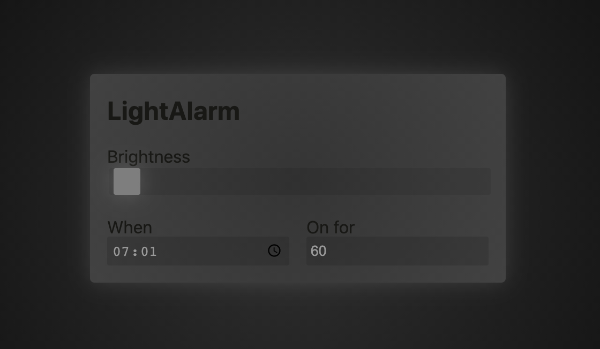

# LightAlarm

I created this project to wake up more smoothly 😊 not only by a horrible alarm bell from my phone but a bit more naturally: ☀️

Sure sun isn't always shining, thus I put a 12V LED strip above my bed that fades in 15 minutes before the bell is hitting in.

## How does it work

An [ESP32](https://www.amazon.de/-/en/AZDelivery-NodeMCU-Development-Successor-Module/dp/B07Z83MF5W/ref=sr_1_4?dchild=1&keywords=esp32&qid=1610799696&sr=8-4) is the main controller

- 📡 **WiFi**: connects to a local network
- 🌐 **WebServer**: provides the website to setup brightness, alarm time and duration
- ☎️ **[WebSockets](https://github.com/gilmaimon/ArduinoWebsockets)**: let the phone/computer that loaded the websites communicate with the ESP32 (single connection)
- 🌓 **Dimming**: a fast pulsing signal that changes the brightness of the LED (connected to MOS-FET)
- ⚡️ **OTA**: the whole setup is also flashable over-the-air (Arduino IDE/ESP32 feature)

A [MOS-FET](https://wiki.seeedstudio.com/Grove-MOSFET/) is connected to the ESP32's control signal, to 12V and the strip.
It basically sits in between the led strip and its power-supply and turns the led on and off whenever the ESP32 tells so (really fast).

## What's controllable

- **☀️ Brightness**: is a manuall brightness contol in case you want to turn the light on without setting the alarm (I know a crazy idea).
- **⏰ Alarm time (when)**: brings up the system timer view and lets you set the time when the digital sun should turn on. Actually it ramps up the light for 15 minutes before this time is reached. So ideally you wake up by the light before the alarm rings.
- **↔ Alarm duration (On for)**: is the place where you specify how long the light should be full brightness
- **🥳 Hidden feature:** Click on the title to turn off the light for this day. Next day it will ramp up the light again 😌

(Disclaimer: This is a result from a quick hack ... not nice, not modular ... but it works for me 🍰)
